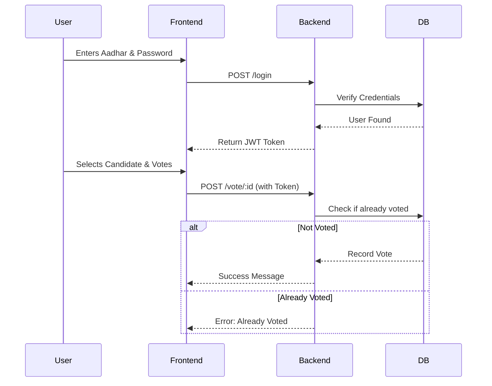

# Voting Webapp

A secure, real-time voting application built with the MERN stack (MongoDB, Express, React/Next.js, Node.js).

## 🚀 Live Demo

- **Frontend (Vercel):** [https://voting-webapp.vercel.app](https://voting-webapp.vercel.app)
- **Backend (Render):** [https://voting-webapp.onrender.com](https://voting-webapp.onrender.com)

---

## ✨ Features

- **User Authentication**: Secure Sign Up/Login using Aadhar card number.
- **Role-Based Access**:
  - **Voters**: Can cast exactly one vote.
  - **Admins**: Manage candidates (Add/Update/Delete), view stats, but *cannot* vote.
- **Live Results**: Real-time leaderboard updates.
- **Secure Voting**: Prevents multiple votes per user.
- **Responsive Design**: Modern UI with Tailwind CSS and Framer Motion animations.

## 📊 System Architecture

```mermaid
graph TD
    User[User / Voter] -->|HTTPS| Frontend[Next.js Frontend\n(Vercel)]
    Frontend -->|API Calls| Backend[Express Backend\n(Render)]
    Backend -->|Read/Write| DB[(MongoDB Atlas)]
    
    subgraph Security
        Backend -- Authenticates --> JWT[JWT Token]
    end
```

## 🗳️ Voting Process



## 🛠️ Tech Stack

- **Frontend**: Next.js 14, Tailwind CSS, Framer Motion, Axios
- **Backend**: Node.js, Express.js, JWT Authentication
- **Database**: MongoDB (Mongoose)
- **Deployment**: Vercel (Frontend), Render (Backend)

---

## ⚙️ Configuration & Setup

### 1. Clone the Repository
```bash
git clone https://github.com/your-username/Voting_webapp.git
cd Voting_webapp
```

### 2. Backend Setup
Navigate to the backend directory and install dependencies:
```bash
cd backend
npm install
```

Create a `.env` file in the `backend/` directory:
```env
PORT=3302
mongoDB=<your_mongodb_connection_string>
JWT_SECRET=<your_jwt_secret>
FRONTEND_URL=http://localhost:3000
ADDITIONAL_FRONTEND_URL=http://localhost:5173
```
*Note: For production (Render), update `FRONTEND_URL` to your Vercel domain (e.g., `https://voting-webapp.vercel.app`).*

**Run the Backend:**
```bash
npm start
# Server runs on http://localhost:3302
```

### 3. Frontend Setup
Navigate to the frontend directory and install dependencies:
```bash
cd ../frontend
npm install
```

Create a `.env.local` file in the `frontend/` directory:
```env
NEXT_PUBLIC_API_URL=http://localhost:3302
```
*Note: For production (Vercel), set `NEXT_PUBLIC_API_URL` to your Render backend URL (e.g., `https://voting-webapp.onrender.com`).*

**Run the Frontend:**
```bash
npm run dev
# App runs on http://localhost:3000
```

---

## 📚 API Routes

### User Authentication
| Method | Endpoint | Description |
|--------|----------|-------------|
| POST | `/signup` | Create a new user account |
| POST | `/login` | Login to an existing account |

### Voting
| Method | Endpoint | Description |
|--------|----------|-------------|
| GET | `/candidates` | Get list of all candidates |
| POST | `/vote/:candidateId` | Vote for a specific candidate |

### Results
| Method | Endpoint | Description |
|--------|----------|-------------|
| GET | `/vote/counts` | Get candidates sorted by vote count |

### User Profile
| Method | Endpoint | Description |
|--------|----------|-------------|
| GET | `/profile` | Get user's profile information |
| PUT | `/profile/password` | Change user's password |

### Admin Management
| Method | Endpoint | Description |
|--------|----------|-------------|
| POST | `/candidates` | Create a new candidate |
| PUT | `/candidates/:candidateId` | Update an existing candidate |
| DELETE | `/candidates/:candidateId` | Delete a candidate |